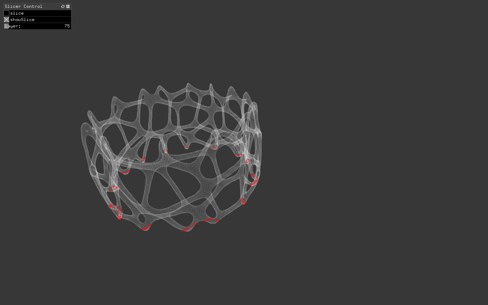

# fluffy-octo-potato

An application for creating and optimizing toolpaths for a 3D printing system consisting of multiple indevidual nozzles. The application is part of a ongoing research collaboration between the Department of Computing, Mathematics and Physics at  Western Norway University of Applied Sciences and the fablab Fellesverkstedet in Oslo.  See separate git for mechanical prototype of the system, based on Fellesverkstedet´s [chamferrail](https://github.com/fellesverkstedet/fabricatable-machines) system.   All code is writter in the c++ framework Openframeworks. 

Currently under heavy development.

## The Slicer 

I created the slicer as a separate addon to Openframeworks. It´s documented [here](https://github.com/frikkfossdal/ofxSlicer). 

## TODO
1. Fix positioning-issue. See comment in code
2. Add progress bar to slicing. 
3. Create toolpaths from sliced meshes
4. Add addaptive slicing for better surface quality
5. Implement simulation of the physical system (I think this is better in a separate applciation for now)
6. Optimize the toolpaths for multiheaded system. Think a good start here could be to investigate how genetic algorithms are used  to optimize trajectories in robotics.
